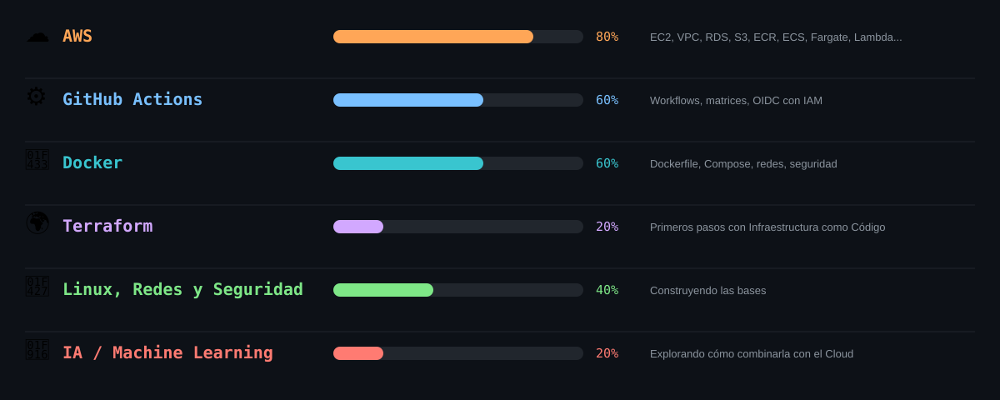

  

  📍 España &nbsp;·&nbsp; 💼 Cuentas por Pagar (SAP) &nbsp;·&nbsp; 🎯 Cloud & DevOps

Tengo 20 años y no vengo del mundo de las finanzas — de hecho, no tengo estudios en el sector. Empecé haciendo prácticas en una empresa y, cuando surgió la oportunidad de quedarme en ese puesto, la acogí sin dudarlo. Me dio conocimiento sobre un terreno totalmente distinto, otra visión de las cosas y, sobre todo, la capacidad de adaptarme a cualquier entorno partiendo de cero.

Pero lo que de verdad me apasiona es la informática, así que estudio y aprendo algo nuevo cada día porque quiero llegar lejos, y porque quiero aportar mi granito de arena a la humanidad construyendo software que resuelva problemas reales a la gente — cada vez más orientado al Cloud y la Inteligencia Artificial.

 

  

  

  Construido a base de documentación, café y algún que otro <code>console.log()</code> 🐛☕

  

  

  

  

  

